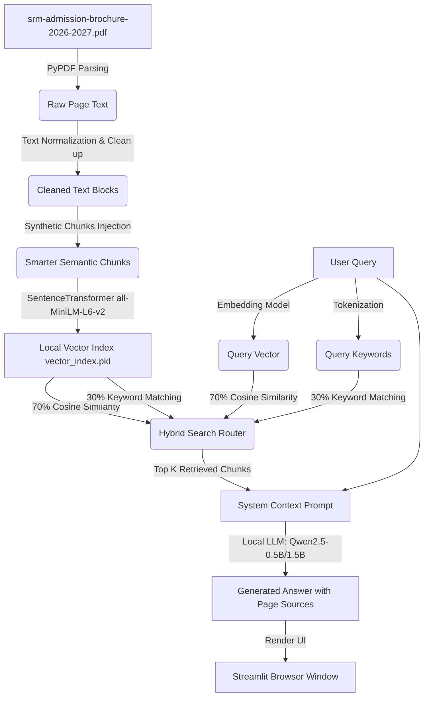

# SRM Admissions AI Hub

An offline, private, and fully local AI assistant designed to answer questions, resolve doubts, and retrieve detailed information from the **SRM Admission Brochure 2026-2027** PDF. 

This project demonstrates a production-grade **Retrieval-Augmented Generation (RAG)** pipeline that runs completely locally without external API keys or internet dependencies, making it highly secure, cost-free, and private.

---

## 🚀 Key Features

* **100% Offline & Private**: Runs completely on local hardware. No API keys, no data leaves your machine, and no usage fees.
* **Streamlit Glassmorphic UI**: A modern, interactive web-based chat interface designed with clean dark-mode aesthetics, responsive chat bubbles, and collapsible reference drawers.
* **Hybrid Search Retrieval**: Combines semantic search (dense vector embeddings) with keyword search (BM25-lite overlap) at a 70/30 weighting. This ensures the system retrieves both conceptual ideas and specific numbers (like placement counts, percentages, and course names).
* **Smart Text Normalization**: Automatically repairs PDF extraction noise, including squished lines (e.g., `Highest Salary65 LPA` -> `Highest Salary 65 LPA`) and ligature symbols.
* **Synthetic Fact Injection**: Auto-generates clean, human-readable text summaries for dense data-tables (such as placement stats) to guarantee high-accuracy retrieval.
* **Multi-Model Local LLM Support**: Toggle directly between:
  - **Qwen 2.5 0.5B Instruct** (Extremely fast, low-memory footprint, ~950MB download)
  - **Qwen 2.5 1.5B Instruct** (Highly accurate, recommended for complex queries, ~3.1GB download)
* **GPU & CPU Hardware Auto-Detection**: Seamlessly detects if an NVIDIA CUDA GPU is available (e.g., RTX 3050) and auto-optimizes model loading using `float16` precision to fit in VRAM.

---

## 🛠️ Architecture & System Workflow



---

## 💻 Tech Stack

* **Frontend**: Streamlit, custom CSS (Glassmorphism, custom Outfit & Plus Jakarta fonts).
* **PDF Reader**: PyPDF.
* **Vector Embeddings**: Sentence-Transformers (`all-MiniLM-L6-v2`).
* **Inference Pipeline**: Hugging Face Transformers, PyTorch, Accelerate.
* **Language Model**: Qwen 2.5 Instruct Series (0.5B / 1.5B parameters).

---

## 📥 Setup & Installation

### Prerequisites
Make sure you have **Python 3.10+** and `uv` (recommended) or `pip` installed.

### Step 1: Clone or Open the Project
Open your terminal in the project directory:
```bash
cd "e:\projects\srm ai hub"
```

### Step 2: Initialize Virtual Environment & Install Dependencies
Using `uv` (fastest):
```bash
uv venv --python 3.11
uv pip install -r requirements.txt
```
Using standard `pip`:
```bash
python -m venv .venv
.venv\Scripts\activate
pip install -r requirements.txt
```

### Step 3: Run the Streamlit Application
```bash
.venv\Scripts\streamlit run app.py
```
Streamlit will launch, and you can open the app in your browser at `http://localhost:8501`.

---

## ⚡ Enabling NVIDIA GPU (CUDA) Support
If you have an NVIDIA Graphics Card (e.g. GeForce RTX 3050/3060/4060), you can make the generation **10x to 20x faster** by installing the CUDA version of PyTorch:

```bash
.venv\Scripts\uv pip install torch --index-url https://download.pytorch.org/whl/cu121 --force-reinstall
```
Once installed, the sidebar under the **Hardware & Status** panel will show:
`GPU Acceleration enabled (NVIDIA GeForce RTX 3050 Laptop GPU)`

---

## 🔎 Example Queries to Test
* *"What is the highest placement package offered at SRMIST?"*
* *"What B.Tech engineering majors are available?"*
* *"How many startup companies were incubated on campus?"*
* *"What is the eligibility for the Law programs and which entrance exam is required?"*
* *"List the campus locations of SRM University."*
